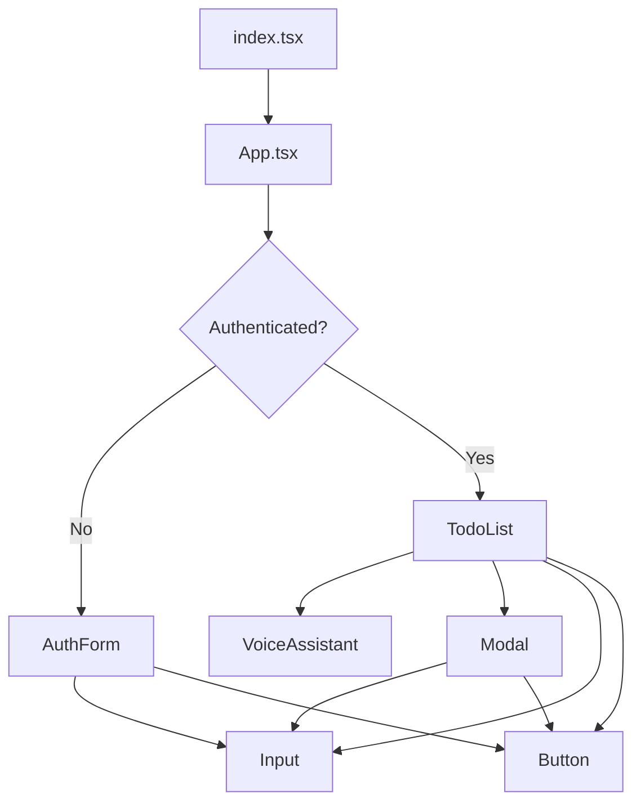
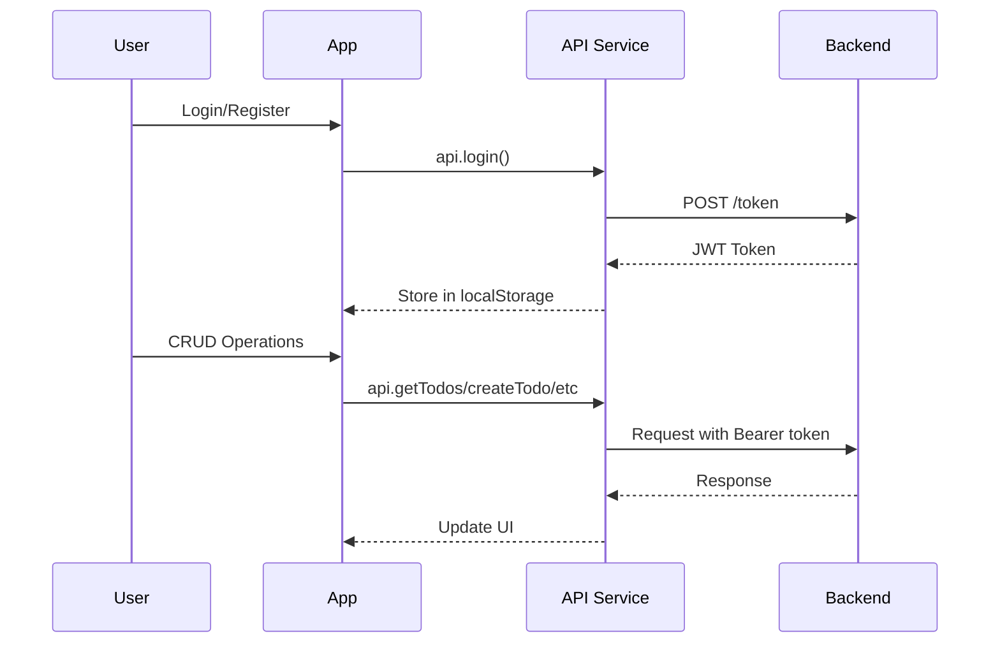

<div align="center">

</div>

# Run and deploy your AI Studio app

This contains everything you need to run your app locally.

View your app in AI Studio: https://ai.studio/apps/drive/1qsN9_0ObAyyKDwE9ZRyEQ8yqtIW64LLy

## Run Locally

**Prerequisites:**  Node.js


1. Install dependencies:
   `npm install`
2. Set the `GEMINI_API_KEY` in [.env.local](.env.local) to your Gemini API key
3. Run the app:
   `npm run dev`

---

## 🏗️ Architecture

### Project Structure

```
to-do-frontend/
├── index.html          # HTML entry point
├── index.tsx           # React app bootstrap
├── App.tsx             # Root component (auth routing)
├── types.ts            # TypeScript interfaces
├── components/         # UI Components
│   ├── AuthForm.tsx    # Login/Register form
│   ├── TodoList.tsx    # Main todo management UI
│   ├── VoiceAssistant.tsx # AI-powered voice control
│   ├── Button.tsx      # Reusable button component
│   ├── Input.tsx       # Reusable input component
│   └── Modal.tsx       # Reusable modal component
├── services/
│   └── api.ts          # Backend API client
└── utils/
    └── audioUtils.ts   # Audio processing for voice
```

### Component Architecture



### Data Flow



### Key Components

| Component | Responsibility |
|-----------|---------------|
| **App.tsx** | Authentication state management, routing between auth and todo views |
| **AuthForm.tsx** | User login and registration with auto-login after signup |
| **TodoList.tsx** | Full todo CRUD operations, filtering, search, and priority management |
| **VoiceAssistant.tsx** | Gemini AI integration for voice-controlled todo management |
| **api.ts** | Centralized API client with JWT token handling and error management |

### Tech Stack

| Layer | Technology |
|-------|------------|
| Framework | React 19 + TypeScript |
| Build Tool | Vite 6 |
| Icons | Lucide React |
| AI/Voice | Google GenAI SDK |
| Backend | FastAPI (Render hosted) |
