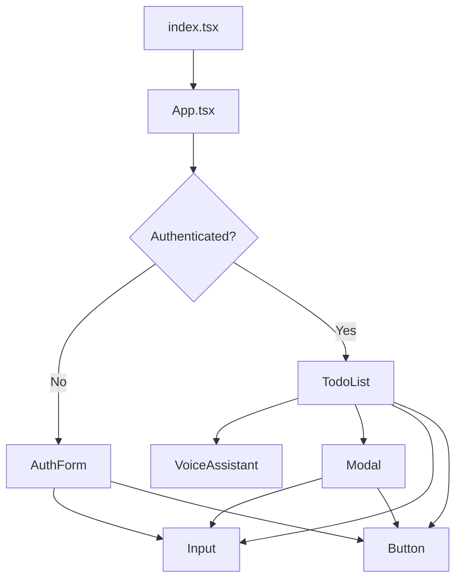
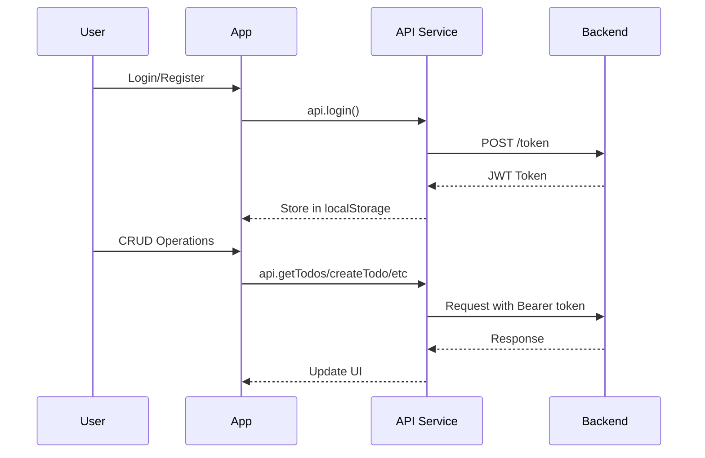

<div align="center">

</div>

# FastTodo Frontend

A modern React frontend for the FastTodo task management application, featuring AI-powered voice control.

## 🚀 Quick Start

**Prerequisites:** Node.js 18+

```bash
# Install dependencies
npm install

# Run development server
npm run dev
```

The app will be available at `http://localhost:5173`

> **Note:** Requires the [FastTodo backend](https://github.com/sajankp/to-do) running locally or deployed.

---

## 🏗️ Architecture

### Project Structure

```
to-do-frontend/
├── index.html          # HTML entry point
├── index.tsx           # React app bootstrap
├── App.tsx             # Root component (auth routing)
├── types.ts            # TypeScript interfaces
├── components/         # UI Components
│   ├── AuthForm.tsx    # Login/Register form
│   ├── TodoList.tsx    # Main todo management UI
│   ├── VoiceAssistant.tsx # AI-powered voice control
│   ├── Button.tsx      # Reusable button component
│   ├── Input.tsx       # Reusable input component
│   └── Modal.tsx       # Reusable modal component
├── services/
│   └── api.ts          # Backend API client
└── utils/
    └── audioUtils.ts   # Audio processing for voice
```

### Component Architecture


```mermaid
graph TD
    A[index.tsx] --> B[App.tsx]
    B --> C{Authenticated?}
    C -->|No| D[AuthForm]
    C -->|Yes| E[TodoList]
    E --> F[VoiceAssistant]
    E --> G[Modal]
    D --> H[Input]
    D --> I[Button]
    E --> H
    E --> I
    G --> H
    G --> I
```

### Data Flow


```mermaid
sequenceDiagram
    participant User
    participant App
    participant API Service
    participant Backend

    User->>App: Login/Register
    App->>API Service: api.login()
    API Service->>Backend: POST /token
    Backend-->>API Service: JWT Token
    API Service-->>App: Store in localStorage

    User->>App: CRUD Operations
    App->>API Service: api.getTodos/createTodo/etc
    API Service->>Backend: Request with Bearer token
    Backend-->>API Service: Response
    API Service-->>App: Update UI
```

### Key Components

| Component              | Responsibility                                                        |
| ---------------------- | --------------------------------------------------------------------- |
| **App.tsx**            | Authentication state management, routing between auth and todo views  |
| **AuthForm.tsx**       | User login and registration with auto-login after signup              |
| **TodoList.tsx**       | Full todo CRUD operations, filtering, search, and priority management |
| **VoiceAssistant.tsx** | Gemini AI integration for voice-controlled todo management            |
| **api.ts**             | Centralized API client with JWT token handling and error management   |

### Tech Stack

| Layer      | Technology                           |
| ---------- | ------------------------------------ |
| Framework  | React 19 + TypeScript                |
| Build Tool | Vite 6                               |
| Icons      | Lucide React                         |
| AI/Voice   | Google GenAI SDK (via backend proxy) |
| Backend    | FastAPI                              |

---

## 🤝 Contributing

See the [backend repository](https://github.com/sajankp/to-do) for:

- Development workflows (`.agent/workflows/`)
- Coding standards (`AGENTS.md`)
- Feature specs and ADRs (`docs/`)

---

## 📄 License

MIT
